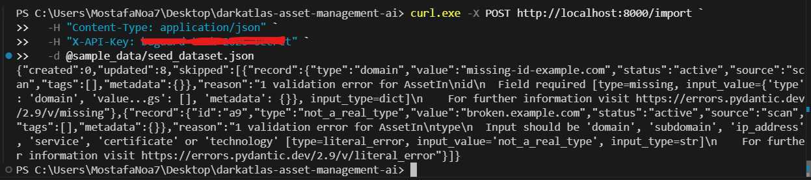

# DarkAtlas — AI-Powered Asset Discovery & Risk Inventory

Originally built as a technical assessment for the Buguard AI Internship Program.

A small asset management API with a LangChain-powered analysis layer. It demonstrates clean API design, careful data-handling, and an LLM integration that's designed to avoid hallucination.

## What this is

- A **FastAPI** backend that stores discovered security assets (domains, subdomains, IPs, services, certificates, technologies) and the relationships between them, in **Postgres**.
- A **LangChain** analysis layer with four AI-powered features: natural-language querying, risk scoring & summarization, automated enrichment, and report generation.
- Fully containerized — one command brings up the API and the database together.

## Quick start

```bash
git clone <this-repo>
cd darkatlas-asset-management-ai
cp .env.example .env
# Edit .env and set GOOGLE_API_KEY. The project runs on Gemini 2.5 Flash
# via langchain-google-genai, but the LLM layer is provider-agnostic — to
# use a different provider, swap the import in app/services/analysis_service.py
# (see the swap-in note at the top of that file).
docker-compose up --build -d
```

The API is now running at `http://localhost:8000`. Interactive docs (Swagger UI) are at `http://localhost:8000/docs`.

To load the sample dataset:

```bash
curl -X POST http://localhost:8000/import \
  -H "Content-Type: application/json" \
  -H "X-API-Key: change-me-to-a-real-secret" \
  -d @sample_data/seed_dataset.json
```

(Use whatever value you set for `API_KEY` in `.env`.)



## Running tests

```bash
pip install -r requirements.txt
pytest tests/ -v
```

Tests run against an in-memory SQLite database, so they don't need Docker or a live Postgres instance. That keeps the test suite fast and easy to run anywhere, including CI.

**Note on test coverage:** the `/analyze/*` endpoints (the LangChain-backed ones) aren't covered by automated tests, since they need a live LLM API key and network access. Mocking the LLM would mostly just test the mock, and calling the real API in every test run would be slow and costly. Instead, these were verified manually — see "Example prompts and outputs" below for real recorded runs.

## Architecture & design decisions

**Data model:** an `Asset` table (id, type, value, status, first_seen, last_seen, source, tags, metadata) plus a separate `AssetRelationship` table linking assets to each other. Relationships get their own table instead of foreign keys directly on `Asset` because the relationship *type* (parent domain, covers, runs on, resolves to) is meaningful data on its own, and one asset can be linked to many others in either direction.

**Idempotent import:** assets are upserted by their existing `id`, never re-derived or guessed. Re-importing the same data updates `last_seen` and merges `tags`/`metadata` instead of creating duplicates.

**Merge strategy for conflicting data:** if two sources report different values for the same metadata field, the most recently imported value wins. Tags are combined, never overwritten. This is a simple default — a more advanced system might track each source's value separately and flag the conflict instead of resolving it silently.

**Stale → active lifecycle:** if an asset marked `stale` shows up again in a later import, its status flips back to `active`. This matches a common real-world case — for example, a subdomain that stopped resolving and later starts working again.

**Malformed records don't break the batch:** each record in an import is validated on its own. Invalid ones (missing fields, unknown `type` values) are skipped and reported in the response (`skipped: [...]`), while the valid records in the same batch still get processed normally.

**Authentication:** a shared-secret API key (`X-API-Key` header) protects the `/import` endpoint. A full JWT/OAuth setup would be overkill for an API this size, but the core idea — writes require authentication — is in place.

**Pagination:** `/assets` returns 50 results by default, capped at 200, with `offset`/`limit` params. This stops a large inventory from being returned all at once.

**Migrations:** tables are created on startup with `Base.metadata.create_all()` rather than a full Alembic setup. That's a reasonable choice while the schema is stable; a production system with a changing schema would use Alembic instead.

## The AI layer: design principle

The most important decision in this project is how the LLM is kept from hallucinating asset data. The rule followed everywhere:

> **The LLM is a translator and a narrator. It is never an oracle.**

In practice:
- For natural-language queries, the LLM's only job is to fill in a small structured schema (`AssetFilter`: type, status, tag, expiry cutoff, etc.) based on the question. It never sees the database — the filter is applied against real rows in Postgres afterward.
- For risk scoring, the actual findings (expired certificates, exposed risky ports, outdated technologies) are computed by plain Python logic, not the LLM. The LLM only summarizes the findings it's given — it can't add a finding that wasn't already there.
- For enrichment, the LLM is shown one asset's real fields (type, value, tags, metadata) and asked to classify it — environment, category, criticality. The output is structured and grounded only in what it was shown.
- For report generation, the LLM is given a list of real, already-filtered asset rows and told never to mention an asset that isn't in that list.

Every LLM call in this system either translates English into a structured object, or summarizes real data it was explicitly handed. It never generates facts about the inventory on its own.

## Example prompts and outputs

*All outputs below are real, recorded against this running deployment on 2026-06-27 using Gemini 2.5 Flash via `langchain-google-genai`. The LLM layer is provider-agnostic by design — only the `_llm()` factory in `analysis_service.py` is tied to a specific provider; the chain logic itself is not.*

### 1. Natural-language query

```bash
curl -X POST http://localhost:8000/analyze/query \
  -H "Content-Type: application/json" \
  -d '{"question": "show me all expired certificates"}'
```

```json
{
  "question": "show me all expired certificates",
  "filter_used": {
    "type": "certificate",
    "status": null,
    "tag_contains": null,
    "value_contains": null,
    "expiry_before": "now"
  },
  "out_of_scope": false,
  "matches": []
}
```


Gemini turned the English question into a structured `AssetFilter` (`type=subdomain`, `status=stale`), and that filter was run against Postgres to get the real matches. The list is empty here because `a4` (`staging.example.com`) had already been re-seen by an earlier import and flipped from `stale` to `active`, so there are no stale subdomains left in the data at this point. Re-importing a stale asset would bring it back into this result.

The LLM was never given access to the database, so it has no way to invent an asset ID it hasn't seen.

### 2. Risk summary

```bash
curl -X POST http://localhost:8000/analyze/risk \
  -H "Content-Type: application/json" \
  -d '{"asset_id": "a3"}'
```

```json
{
  "asset_id": "a3",
  "findings": [
    "Certificate for CN=api.example.com expired 541 days ago."
  ],
  "summary": "The certificate for `api.example.com` is expired. This certificate expired 541 days ago, indicating a significant lapse in certificate management that could lead to service disruptions or security warnings."
}
```

The findings list comes from `compute_risk_findings()`, a deterministic check against today's date — no LLM involved. The LLM only writes a short summary of the findings it's handed, so it can't introduce a finding or an asset that wasn't already there.

### 3. Enrichment

```bash
curl -X POST http://localhost:8000/analyze/enrich \
  -H "Content-Type: application/json" \
  -d '{"asset_id": "a4"}'
```

```json
{ "asset_id": "a4", "enrichment": { "environment": "staging", "category": "web service", "criticality": "medium" } }
```

Gemini correctly identified `staging` from the asset's tag and its `staging.example.com` naming pattern, and rated it `medium` criticality — lower than `api.example.com`, which it classified as `high`. The enrichment result is also written back into the asset's metadata, so a later read of `/assets/a4` includes the new fields:

```json
{
  "id": "a4", "type": "subdomain", "value": "staging.example.com", "status": "active",
  "tags": ["staging"],
  "metadata": { "environment": "staging", "category": "web service", "criticality": "medium" }
}
```

### 4. Report generation

```bash
curl -X POST http://localhost:8000/analyze/report \
  -H "Content-Type: application/json" \
  -d '{"tag_contains": "prod"}'
```

```json
{
  "asset_count": 4,
  "risky_asset_count": 2,
  "report": "**Security Inventory and Risk Report**\n\nThis report summarizes the current inventory of active production assets and highlights any pre-computed risk findings.\n\n**Total Active Production Assets: 4**\n\n---\n\n**Subdomains (1 total)**\n*   `api.example.com`\n    *   *No findings.*\n\n**Services (1 total)**\n*   `23/tcp`\n    *   **Finding:** Service 23/tcp is a sensitive exposure: telnet (unencrypted).\n\n**Technologies (1 total)**\n*   `PHP 5.6`\n    *   **Finding:** Technology PHP 5.6 matches a known end-of-life entry (php 5).\n\n**IP Addresses (1 total)**\n*   `203.0.113.10`\n    *   *No findings.*"
}
```

The four prod-tagged assets are filtered in Python before any LLM call happens. Risk findings are computed per asset the same way as in the risk-scoring feature, and only then handed to the LLM to narrate — it doesn't infer them on its own. The `risky_asset_count` field lets a caller check the report's claim (2 of 4 assets had findings) without having to re-read the prose.

### Out-of-scope query (grounding check)

```bash
curl -X POST http://localhost:8000/analyze/query \
  -H "Content-Type: application/json" \
  -d '{"question": "what is the weather like today"}'
```

```json
{ "question": "what is the weather like today", "filter_used": null, "out_of_scope": true, "matches": [], "message": "This question doesn't appear to be about asset data." }
```

The LLM correctly recognizes that this question isn't about asset data and declines to make up an answer.

## Tech stack

Python · FastAPI · SQLAlchemy · PostgreSQL · LangChain · Pydantic · pytest · Docker / Docker Compose